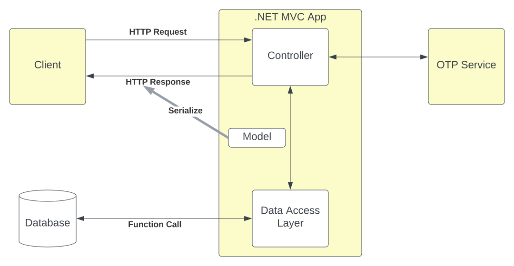
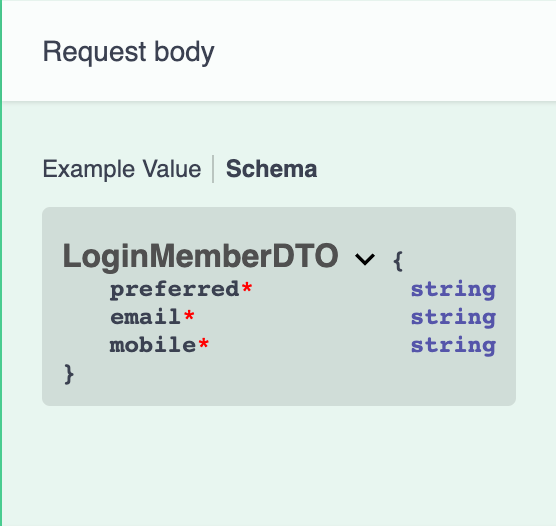

# .NET 6 for API development - First Step

This tutorial teaches the basics of building a web API with .NET 6 and ASP.NET 6.

In this tutorial, you will learn how to:

* Create a web API project.
* Add a model class.
* Scaffold a controller.
* Configure routing, URL paths, and return values.

At the end, you will have a web API that can:

* Call postgresql function to validate user.
* Call another API to trigger one time passcode.
* Return a JSON response.

## Overview

| API | Description | Request Body | Response Body |
| ----------- | ----------- | ----------- | ----------- |
| POST /wx/v1/loyalty/rewards/customer-hub/cards/login | Login and send one time passcode to email or mobile | LoginRequestDto | LoginResponseDto |



## Prerequisites

* [Visual Studio Code](https://code.visualstudio.com/download)
* [C# for Visual Studio Code](https://marketplace.visualstudio.com/items?itemName=ms-dotnettools.csharp)
* [.NET 6.0 SDK](https://dotnet.microsoft.com/download/dotnet/6.0)

## Create a web project

* Open Visual Studio Code
* Open the integrated terminal
* Change directories (`cd`) to the folder that will contain the project folder.
* Run the following commands:
```
dotnet new webapi -o wx-api-rewards-customer-hub
cd wx-api-rewards-customer-hub
dotnet add package Npgsql
code -r ../wx-api-rewards-customer-hub
```
* These commands:
  * Create a new web API project and open it in Visual Studio Code.
  * Add a NuGet package that is needed for the next section.
* When a dialog box asks if you want to add required assets to the project, select **Yes**.

## Test the project

* Trust the HTTPS development certificate by running the following command:
```
dotnet dev-certs https --trust
```
* Start the Kestrel web server with hot reload
```
dotnet watch run
```

The Swagger page `/swagger/index.html` is displayed. Select **GET** > **Try it out** > **Execute**. The page displays:

* The curl command to test the WeatherForecast API.
* The URL to test the WeatherForecast API.
* The response code, body, and headers.
* A drop down list box with media types and the example value and schema.

## Use multiple environments
The file `Properties/launchSettings.json` has important environmental settings for web server, launch url, etc.

```
"profiles": {
  "dev": {
    "commandName": "Project",
    "dotnetRunMessages": true,
    "launchBrowser": true,
    "launchUrl": "swagger",
    "applicationUrl": "https://localhost:3500",
    "environmentVariables": {
      "ASPNETCORE_ENVIRONMENT": "Development"
    }
  },
  "prod": {
    "commandName": "Project",
    "dotnetRunMessages": true,
    "launchBrowser": false,
    "applicationUrl": "https://localhost:3500",
    "environmentVariables": {
      "ASPNETCORE_ENVIRONMENT": "Production"
    }
  },
  "IIS Express": {
    "commandName": "IISExpress",
    "launchBrowser": true,
    "environmentVariables": {
      "ASPNETCORE_ENVIRONMENT": "Development"
    }
  }
}
```

By Default, dotnet runs the first profile, run the following command to explicitly select profile:
```
dotnet run --launch-profile "dev"
```
For this example, dev/prod both listens on port 3500, using Kestrel as the web server, dev will launch user's default browser and display swagger. 

For details please refer to Microsoft's official document - [Use multiple environments in ASP.NET Core](https://docs.microsoft.com/en-us/aspnet/core/fundamentals/environments?view=aspnetcore-6.0).

## Add a model class
A *model* is a set of classes that represent the data that the app manages.
- Add a folder named *Models*.
- Add a `Member.cs` file to the Models folder with the following code:
```C#
namespace wx_api_rewards_customer_hub.Models;

public class member
{
    public string CRN { get; set; }
    public string CardNumber { get; set; }
    public string Email { get; set; }
    public string Mobile { get; set; }
    public string FirstName { get; set; }
    public string LastName { get; set; }
}
```
Model classes can go anywhere in the project, but the *Models* folder is used by convention.

## Add DTO classes
A DTO(Data Transfer Object) may be used to:

- Prevent over-posting.
- Hide properties that clients are not supposed to view.
- Omit some properties in order to reduce payload size.
- Flatten object graphs that contain nested objects. Flattened object graphs can be more convenient for clients.

Add `LoginMemberDTO` class into `Member.cs`, this will be used as the incoming request object:
```C#
public class LoginMemberDTO
{
    public string Preferred { get; set; }
    public string Email { get; set; }
    public string Mobile { get; set; }
}
```

Add `OTPToken` class into `Member.cs`, this will be used as the embedded reponse object of `Response` type:
```C#
public class OTPToken
{
    public string Token { get; set; }
}
```

Add `Response.cs`, this type is a simple wrapper of actual responses, to provide a general API interface with `data` as root:
```C#
public class Response<T>
{
    public T? Data { get; set; }
}
```
The response with this wrapper looks like for type `Response<OTPToken>>`:
```JSON
{
    "data": {
        "token": "TEST OTP Token"
    }
}
```

## Scaffold a controller
```
dotnet add package Microsoft.VisualStudio.Web.CodeGeneration.Design
dotnet tool install -g dotnet-aspnet-codegenerator
```
Let's have a look at the generated controller code:
```C#
using Microsoft.AspNetCore.Mvc;

namespace wx_api_rewards_customer_hub.Controllers
{
    [Route("wx/v1/loyalty/rewards/customer-hub/[controller]/[action]")]
    [ApiController]
    public class CardsController : ControllerBase
    {
    }
}
```
The generated code:
- Uses [`Microsoft.AspNetCore.Mvc`](https://docs.microsoft.com/en-us/aspnet/core/mvc/overview?view=aspnetcore-6.0) web app framework.
- Marks the class with the [`[ApiController]`](https://docs.microsoft.com/en-us/aspnet/core/web-api/?view=aspnetcore-6.0#apicontroller-attribute)] attribute. This attribute indicates that the controller responds to web API requests.
- Adds a routing with the [[Route("api/[controller]/[action]")]](https://docs.microsoft.com/en-us/aspnet/core/mvc/controllers/routing?view=aspnetcore-6.0#verb) attribute. This attribute indicates that the controller responds to web API requests with path `/api/Cards/[Action]`.
- Action method name will be used to match the `[Action]` component of the path.

## Generate a default `.gitignore` then initialize the git repo
```
dotnet new gitignore
git init
```
For this tutorial, `appsettings.*.json` will serve app configurations, e.g. database connection strings. Add them into .gitignore file for security reason:
```
echo "\n# appsettings\n**/appsettings*" >> .gitignore
git add .
git commit
```

## Add an action method
```C#
[HttpPost]
public async Task<ActionResult<Response<OTPToken>>> Login(LoginMemberDTO loginMemberDTO)
{
    OTPToken result = new OTPToken
    {
        Token = "TEST OTP Token"
    };
    return Created(string.Empty, new Response<OTPToken>
    {
        Data = result
    });
}
```
This action method reponds to `POST /wx/v1/loyalty/rewards/customer-hub/cards/login` requests.
It also:
- Takes a `LoginMemberDTO` object.
- Responds a `Response<OTPToken>>` object.
- Creates a `201 Created` HTTP status code.
- Creates an empty url in `Location` header.

## Add basic validation
Add `using System.ComponentModel.DataAnnotations;` and `[Required]` to all properties of `LoginRequestDTO`:
```C#
public class LoginMemberDTO
{
    [Required]
    public string Preferred { get; set; }
    [Required]
    public string Email { get; set; }
    [Required]
    public string Mobile { get; set; }
}

```
This change will display these properties as required in swagger:

