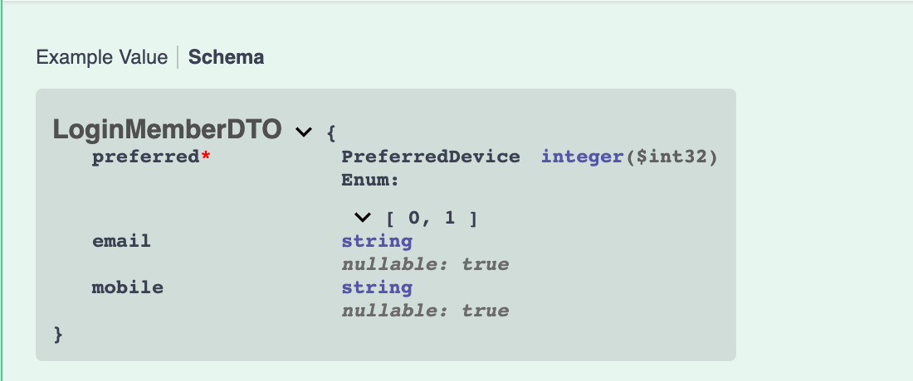

# .NET 6 for API development - First Step

This tutorial teaches the basics of building a web API with .NET 6 and ASP.NET 6.

In this tutorial, you will learn how to:

* Create a web API project.
* Add model classes.
* Scaffold controllers.
* Configure routing, URL paths, and return values.
* Inject services.
* Connect to postgresql database and call stored functions.
* Calling other APIs.

At the end, you will have a web API that can:

* Validate users by calling a postgresql stored function.
* Trigger one time passcode by calling an APIGEE hosted API.
* Return a JSON object.

## Overview

| API | Description | Request Body | Response Body |
| ----------- | ----------- | ----------- | ----------- |
| `POST /wx/v1/loyalty/rewards/customer-hub/cards/login` | Login and send one time passcode to email or mobile | `LoginMemberDTO` | `Response<OTPResponseDTO>` |


## Prerequisites

* [Visual Studio Code](https://code.visualstudio.com/download)
* [C# for Visual Studio Code](https://marketplace.visualstudio.com/items?itemName=ms-dotnettools.csharp)
* [.NET 6.0 SDK](https://dotnet.microsoft.com/download/dotnet/6.0)

## Create a web project

* Open Visual Studio Code
* Open the integrated terminal
* Change directories (`cd`) to the folder that will contain the project folder.
* Run the following commands:
```
dotnet new webapi -o wx-api-rewards-customer-hub-dotnet
cd wx-api-rewards-customer-hub-dotnet
code -r ../wx-api-rewards-customer-hub-dotnet
```
* These commands:
  * Create a new web API project and open it in Visual Studio Code.
  * When a dialog box asks if you want to add required assets to the project, select **Yes**.

## Test the project

* Trust the HTTPS development certificate by running the following command:
```
dotnet dev-certs https --trust
```
* Start the Kestrel web server with hot reload
```
dotnet watch run
```

The Swagger page `/swagger/index.html` is displayed. Select **GET** > **Try it out** > **Execute**. The page displays:

* The curl command to test the WeatherForecast API.
* The URL to test the WeatherForecast API.
* The response code, body, and headers.
* A drop down list box with media types and the example value and schema.

## Use multiple environments
The file `Properties/launchSettings.json` has multiple environmental settings for web server, launch url, etc. Here I created `dev` and `prod` environments, they both use Kestrel as web server, listen on port 3500, `dev` will launch browser and open swagger doc, `prod` will usually run by a linux docker container, so it does not launch browser. There is one more important difference between `Development` and `Production` profiles: exceptions will be replaced with "Internal Server Error" instead of detailed stack tracing logs when running `Production` profile.

```
"profiles": {
  "dev": {
    "commandName": "Project",
    "dotnetRunMessages": true,
    "launchBrowser": true,
    "launchUrl": "swagger",
    "applicationUrl": "https://localhost:3500",
    "environmentVariables": {
      "ASPNETCORE_ENVIRONMENT": "Development"
    }
  },
  "prod": {
    "commandName": "Project",
    "dotnetRunMessages": true,
    "launchBrowser": false,
    "applicationUrl": "https://localhost:3500",
    "environmentVariables": {
      "ASPNETCORE_ENVIRONMENT": "Production"
    }
  },
  "IIS Express": {
    "commandName": "IISExpress",
    "launchBrowser": true,
    "environmentVariables": {
      "ASPNETCORE_ENVIRONMENT": "Development"
    }
  }
}
```

By Default, dotnet runs the first profile, the following command can be used to explicitly select a profile:
```
dotnet run --launch-profile "dev"
```
For details please refer to Microsoft's official document - [Use multiple environments in ASP.NET Core](https://docs.microsoft.com/en-us/aspnet/core/fundamentals/environments?view=aspnetcore-6.0).

## Add model classes and DTO classes
A *model* is a set of classes that represent the data that the app manages.
- Add a folder named *Models*.
- Add a `Member.cs` file to the Models folder with the following code:
```C#
using System.ComponentModel.DataAnnotations;

namespace wx_api_rewards_customer_hub.Models;

public enum PreferredDevice
{
    Email,
    Mobile
}

public enum StoredProcedureResult
{
    Success,
    Failure
}

public class LoginResultDTO
{
    public string? ErrorCode { get; set; }
    public string? ErrorMessage { get; set; }
    public StoredProcedureResult Result { get; set; }
    public string? CRN { get; set; }
    public string? CardNumber { get; set; }
    public string? Email { get; set; }
    public string? Mobile { get; set; }
    public string? FirstName { get; set; }
    public string? LastName { get; set; }
}

public class LoginMemberDTO
{
    public PreferredDevice Preferred { get; set; }
    public string? Email { get; set; }
    public string? Mobile { get; set; }
}
```
Model classes can go anywhere in the project, but the *Models* folder is used by convention.

A DTO(Data Transfer Object) may be used to:

- Prevent over-posting.
- Hide properties that clients are not supposed to view.
- Omit some properties in order to reduce payload size.
- Flatten object graphs that contain nested objects. Flattened object graphs can be more convenient for clients.

`LoginMemberDTO` will be used as the request object.

Add `OTPResponseDTO` class into its own file `OTP.cs`:
```C#
namespace wx_api_rewards_customer_hub.Models;

public class OTPResponseDTO
{
    public string? OTPToken { get; set; }
}
```

Add `Response<T>` into `Response.cs`, this type is a simple wrapper of response object, to provide a general API interface with `data` as root node:
```C#
public class Response<T>
{
    public T? Data { get; set; }
}
```

So that wrapped `OTPResponseDTO` class looks like this in response:
```JSON
{
    "data": {
        "otpToken": "yUZrHudUrUFwXV7wZe0o4UFukAFy"
    }
}
```

## Scaffold a controller
```
dotnet add package Microsoft.VisualStudio.Web.CodeGeneration.Design
dotnet tool install -g dotnet-aspnet-codegenerator
dotnet aspnet-codegenerator controller -name CardsController -async -api -outDir Controllers
```
This is generated controller code:
```C#
using System;
using System.Collections.Generic;
using System.Linq;
using System.Threading.Tasks;
using Microsoft.AspNetCore.Http;
using Microsoft.AspNetCore.Mvc;

namespace wx_api_rewards_customer_hub_dotnet.Controllers
{
    [Route("api/[controller]")]
    [ApiController]
    public class CardsController : ControllerBase
    {
    }
}
```
Change the routing line to `[Route("wx/v1/loyalty/rewards/customer-hub/[controller]/[action]")]`, so that the code:
- Uses [`Microsoft.AspNetCore.Mvc`](https://docs.microsoft.com/en-us/aspnet/core/mvc/overview?view=aspnetcore-6.0) web app framework.
- Marks the class with the [`[ApiController]`](https://docs.microsoft.com/en-us/aspnet/core/web-api/?view=aspnetcore-6.0#apicontroller-attribute)] attribute. This attribute indicates that the controller responds to web API requests.
- Adds a routing with the [[Route("wx/v1/loyalty/rewards/customer-hub/[controller]/[action]")]](https://docs.microsoft.com/en-us/aspnet/core/mvc/controllers/routing?view=aspnetcore-6.0#verb) attribute. This attribute indicates that the controller responds to web API requests with path `/wx/v1/loyalty/rewards/customer-hub/Cards/[Action]`.
- Action method name will be used to match the `[Action]` component of the path.
- All path components are case insensitive.

## Generate a default `.gitignore` then initialize the git repo
```
dotnet new gitignore
git init
```
`appsettings.*.json` will provide app configurations, e.g. database connection parameters. Add them into .gitignore file for security reason:
```
echo "\n# appsettings\n**/appsettings*" >> .gitignore
git add .
git commit
```

## Add an action method
```C#
[HttpPost]
public async Task<ActionResult<Response<OTPResponseDTO>>> Login(LoginMemberDTO loginMemberDTO)
{
    var loginResultDTO = await _cdp.Login(loginMemberDTO);

    if (loginResultDTO.Result == StoredProcedureResult.Success)
    {
        Response<OTPResponseDTO>? otpResponseDTO = await _otp.SendOTP(new OTPRequestDTO(loginMemberDTO, loginResultDTO));
        return Created(string.Empty, otpResponseDTO);
    }

    return Unauthorized(new Error(loginResultDTO.ErrorCode, loginResultDTO.ErrorMessage));
}
```
This action method responds `POST /wx/v1/loyalty/rewards/customer-hub/cards/login` requests.
It also:
- Takes a `LoginMemberDTO` object.
- Returns a `Response<OTPResponseDTO>>` object.
- Creates a `201 Created` HTTP status code.
- Creates an empty url in `Location` header.

## Add basic validation
Add `using System.ComponentModel.DataAnnotations;` and `[Required]` to `Preferred` property of `LoginRequestDTO`:
```C#
public class LoginMemberDTO
{
    [Required]
    public string Preferred { get; set; }
    public string? Email { get; set; }
    public string? Mobile { get; set; }
}

```
This change will display `Preferred` property as required in swagger:


The validations is based on C# type system, because `Preferred` is not-nullable(without the `?`), if it is missing in the request object, like this:
```JOSN
{
    "email": "",
    "mobile": null
}
```
The following HTTP 400 Bad Request error is returned:
```JSON
{
    "type": "https://tools.ietf.org/html/rfc7231#section-6.5.1",
    "title": "One or more validation errors occurred.",
    "status": 400,
    "traceId": "00-8831b3a14faa9b8293918a25a569dedc-b9a51cb2aee71291-00",
    "errors": {
        "Preferred": [
            "The Preferred field is required."
        ]
    }
}
```
What if given the wrong type? E.g. using int instead of string for `Preferred`:
```JSON
{
    "preferred": 123
}
```
Then the whole incoming object will be marked invalid:
```JSON
{
    "type": "https://tools.ietf.org/html/rfc7231#section-6.5.1",
    "title": "One or more validation errors occurred.",
    "status": 400,
    "traceId": "00-21a04d54426e7ca524978fa8d2247b78-afe2bd5f33ac3777-00",
    "errors": {
        "loginMemberDTO": [
            "The loginMemberDTO field is required."
        ],
        "$.preferred": [
            "The JSON value could not be converted to System.String. Path: $.preferred | LineNumber: 1 | BytePositionInLine: 20."
        ]
    }
}
```

## Add database access service
[`Npgsql`](https://www.npgsql.org/index.html) is an open source ADO.NET Data Provider for PostgreSQL, it allows programs written in C#, Visual Basic, F# to access the PostgreSQL database server. It is implemented in 100% C# code, is free and is open source.

Add `Npgsql` package:
```
dotnet add package Npgsql
```
[Configuration in ASP.NET Core](https://docs.microsoft.com/en-us/aspnet/core/fundamentals/configuration/?view=aspnetcore-6.0) has details about various ways to inject application configurations:
- Settings files, such as `appsettings.json`
- Environment variables
- Azure Key Vault
- Azure App Configuration
- Command-line arguments
- Custom providers, installed or created
- Directory files
- In-memory .NET objects

Since JSON is both expressive and accurate, I will use `appsettings.json` for configurations.

Create Development environment database connection parameters in `appsettings.Development.json`:
```
{
  "Logging": {
    "LogLevel": {
      "Default": "Information",
      "Microsoft.AspNetCore": "Warning"
    }
  },
  "CDP": {
    "Host": "localhost",
    "Port": "8888",
    "Database": "lcdm",
    "Username": "api_mandy",
    "Password": "drXXAA24uUtjRcnH66pt"
  }
}
```
The next step is to add a service class `CdpService` and inject into controller `CardsController`, please refer to the [DI](https://docs.microsoft.com/en-us/aspnet/core/fundamentals/dependency-injection?view=aspnetcore-6.0) document for details.

ADO.NET wil be discussed in its own blog(*TODO*), for now, simply create a `Services` folder, then create a file `CdpService.cs` underneath:
```C#
using Npgsql;
using wx_api_rewards_customer_hub.Models;

public enum CDP_SOURCE
{
    CPORTAL = 1,
    MANDY = 2
}

public interface ICdpService
{
    Task<LoginResultDTO> Login(LoginMemberDTO loginRequestDTO);
}

public class CdpService : ICdpService
{
    private readonly IConfiguration _configuration;
    private readonly string _connString;

    public CdpService(IConfiguration configuration)
    {
        _configuration = configuration;
        var host = _configuration["CDP:Host"];
        var port = _configuration["CDP:Port"];
        var database = _configuration["CDP:Database"];
        var username = _configuration["CDP:Username"];
        var password = _configuration["CDP:Password"];
        _connString = $"Host={host};Port={port};Database={database};Username={username};Password={password}";
    }

    public async Task<LoginResultDTO> Login(LoginMemberDTO loginRequestDTO)
    {
        await using var _conn = new NpgsqlConnection(_connString);
        await _conn.OpenAsync();

        await using var cmd = new NpgsqlCommand("SELECT * FROM rtapi.sp_get_mandy_order_card($1, $2, $3, $4, $5, $6)", _conn);
        cmd.Parameters.AddWithValue(loginRequestDTO.Preferred == PreferredDevice.Email ? loginRequestDTO.Email : DBNull.Value);
        cmd.Parameters.AddWithValue(loginRequestDTO.Preferred == PreferredDevice.Mobile ? loginRequestDTO.Mobile : DBNull.Value);
        cmd.Parameters.AddWithValue(DateTime.Now);
        cmd.Parameters.AddWithValue((int)CDP_SOURCE.CPORTAL);
        cmd.Parameters.AddWithValue(CDP_SOURCE.CPORTAL.ToString());
        cmd.Parameters.AddWithValue(DBNull.Value);

        await using var reader = await cmd.ExecuteReaderAsync();

        await reader.ReadAsync();
        return new LoginResultDTO
        {
            ErrorCode = reader.IsDBNull(0) ? null : reader.GetString(0),
            ErrorMessage = reader.IsDBNull(1) ? null : reader.GetString(1),
            Result = reader.GetFieldValue<int>(2),
            CRN = reader.IsDBNull(3) ? null : reader.GetString(3),
            CardNumber = reader.IsDBNull(4) ? null : reader.GetString(4),
            Email = reader.IsDBNull(5) ? null : reader.GetString(5),
            Mobile = reader.IsDBNull(6) ? null : reader.GetString(6),
            FirstName = reader.IsDBNull(7) ? null : reader.GetString(7),
            LastName = reader.IsDBNull(8) ? null : reader.GetString(8)
        };
    }
}
```
Then register it in `Program.cs`:
```C#
...
// Add services to the container.
builder.Services.AddScoped<ICdpService, CdpService>();
...
```
In order to debug sp calls, I usually log them into spluk, it's also a separate topic(*TODO*) in this series, for now, simply adding console logs into `Program.cs`, note that I enabled the parameters as well, **DO NOT** enable it in production if there is any sensitive parameters:
```C#
// Enable postgresql logging
NpgsqlLogManager.Provider = new ConsoleLoggingProvider(NpgsqlLogLevel.Debug);
NpgsqlLogManager.IsParameterLoggingEnabled = true;
```
The call logs looks like:
```
Connection opened
Executing statement(s):
	SELECT * FROM rtapi.sp_get_mandy_order_card($1, $2, $3, $4, $5, $6)
	Parameter $1:	sean.test.env@gmail.com
	Parameter $2:	null
	Parameter $3:	04/21/2022 15:41:28
	Parameter $4:	1
	Parameter $5:	CPORTAL
	Parameter $6:	null

Received notice: Step v_email_id : SEAN.TEST.ENV@GMAIL.COM
Received notice: Step v_mobile_ph : 
Received notice: Step 2
Received notice: Step 3
Query duration time: 44ms
Connection closed
```

## Add authentication service
OTP handler is an authentication service hosted in APIGEE, our API needs to call it to trigger sending a one time passcode to either mobile or email. An OTPToken will also be returned. Thus clients can ask members to type one time passcode then send it back along with OTPToken to complete the login process.

Add `System.Net.Http.Json`:
```
dotnet add package System.Net.Http.Json
```
Add a model class `OTPRequestDTO` for calling OTP handler:
```C#
namespace wx_api_rewards_customer_hub.Models;

public class OTPRequestDTO
{
    public string SendTo { get; set; } = null!;
    public string? MobilePhone { get; set; }
    public string? Email { get; set; }
    public string? CRN { get; set; }
    public string? FirstName { get; set; }

    public OTPRequestDTO(LoginMemberDTO loginMemberDTO, LoginResultDTO loginResultDTO)
    {
        SendTo = loginMemberDTO.Preferred.ToString();
        MobilePhone = loginResultDTO.Mobile;
        Email = loginResultDTO.Email;
        CRN = loginResultDTO.CRN;
        FirstName = loginResultDTO.FirstName;
    }
}
```
Now add the service class and its interface:
```C#
using wx_api_rewards_customer_hub.Models;

public interface IOtpService
{
    Task<Response<OTPResponseDTO>?> SendOTP(OTPRequestDTO otpRequestDTO);
}

public class OtpService : IOtpService
{
    private readonly IConfiguration _configuration;
    private readonly HttpClient _client;

    public OtpService(IConfiguration configuration)
    {
        _configuration = configuration;
        _client = new HttpClient();
        _client.DefaultRequestHeaders.Add("client_id", _configuration["MANDY_CLIENT_ID"]);
    }

    public async Task<Response<OTPResponseDTO>?> SendOTP(OTPRequestDTO otpRequestDTO)
    {
        var resp = await _client.PostAsJsonAsync(_configuration["OTP_HANDLER_CREATEOTP_URL"], otpRequestDTO);
        resp.EnsureSuccessStatusCode();
        
        return await resp.Content.ReadFromJsonAsync<Response<OTPResponseDTO>>();
    }
}
```
Register `OtpService` into DI container in `Program.cs`:
```C#
...
builder.Services.AddScoped<IOtpService, OtpService>();
...
```
Here is the final `CardsController` with injected `CdpService` and `OtpService`:
```C#
using Microsoft.AspNetCore.Mvc;
using wx_api_rewards_customer_hub.Models;

namespace wx_api_rewards_customer_hub.Controllers
{
    [Route("wx/v1/loyalty/rewards/customer-hub/[controller]/[action]")]
    [ApiController]
    public class CardsController : ControllerBase
    {
        private readonly ICdpService _cdp;
        private readonly IOtpService _otp;

        public CardsController(ICdpService cdp, IOtpService otp)
        {
            _cdp = cdp;
            _otp = otp;
        }

        [HttpPost]
        public async Task<ActionResult<Response<OTPTokenDTO>>> Login(LoginMemberDTO loginMemberDTO)
        {
            var loginResultDTO = await _cdp.Login(loginMemberDTO);

            if (loginResultDTO.Result == StoredProcedureResult.Success)
            {
                Response<OTPResponseDTO>? otpResponseDTO = await _otp.SendOTP(new OTPRequestDTO(loginMemberDTO, loginResultDTO));
                return Created(string.Empty, otpResponseDTO);
            }

            return Unauthorized(new Error(loginResultDTO.ErrorCode, loginResultDTO.ErrorMessage));
        }
    }
}
```
The constructor declares two dependencies, they are resolved automatically.

The DI topic will be in its own blog(*TODO*).